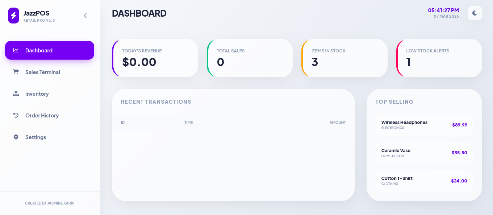
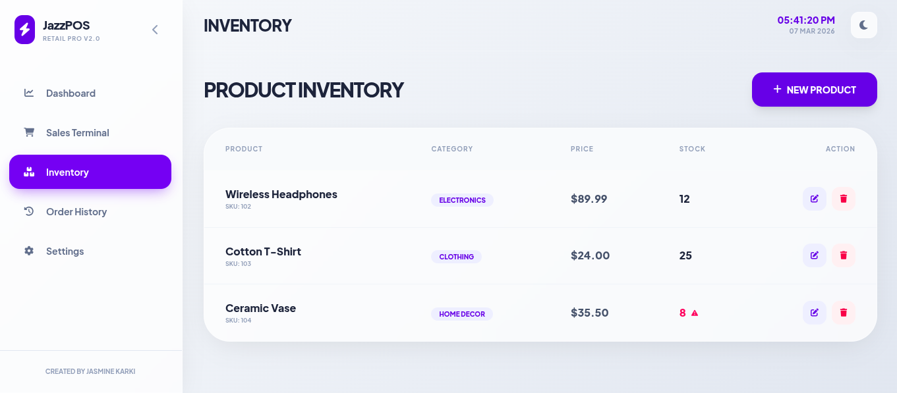
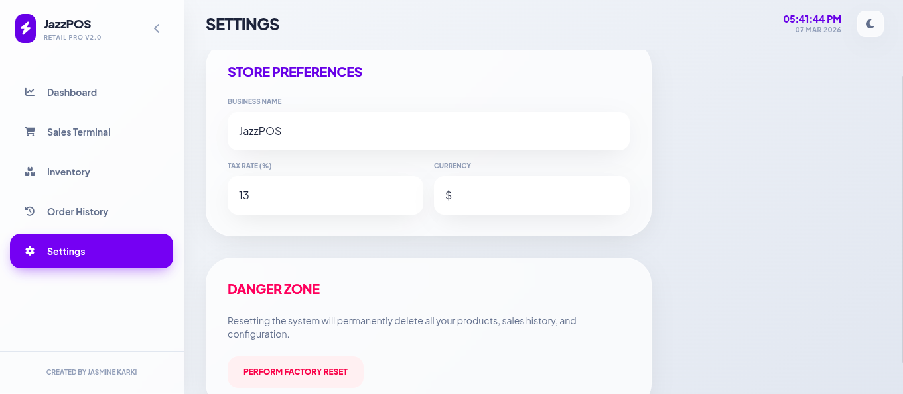

<!DOCTYPE html>
<html lang="en">
<head>
    <meta charset="UTF-8">
    <meta name="viewport" content="width=device-width, initial-scale=1.0">
    <title>JazzPOS - Retail Pro V2.0 README</title>
    
    
</head>
<body class="p-4 md:p-8 lg:p-12">

    

        
        <!-- Header Section -->
        <header class="hero-gradient text-white p-12 rounded-[40px] mb-12 shadow-2xl relative overflow-hidden">
            

                <h1 class="text-5xl md:text-7xl font-bold mb-6 italic tracking-tight">⚡ JazzPOS</h1>
                

                    Retail Pro V2.0: A modern, high-performance Point of Sale system designed for retail excellence.
                

            

            <!-- Decorative circle -->
            

        </header>

        <!-- Main Dashboard Image -->
        <section class="mb-16">
            

                
            

        </section>

        <!-- Intro Text -->
        <section class="mb-16 text-center max-w-3xl mx-auto">
            <h2 class="text-3xl font-bold mb-6 text-slate-800">Intuitive. Clean. Powerful.</h2>
            

                Built with a focus on intuitive user experience and clean aesthetics, JazzPOS provides business owners with real-time insights, effortless inventory management, and a streamlined sales process.
            

        </section>

        <!-- Features Grid -->
        

            <!-- Dashboard Feature -->
            

                
📊

                <h3 class="text-2xl font-bold mb-4">Comprehensive Dashboard</h3>
                <ul class="space-y-3 text-lg text-slate-600">
                    <li><strong>Real-time Metrics:</strong> Track Revenue, Sales, and Stock.</li>
                    <li><strong>Low Stock Alerts:</strong> Visual indicators for replenishment.</li>
                    <li><strong>History:</strong> Monitor recent sales activity instantly.</li>
                    <li><strong>Top Selling:</strong> Quick view of popular items.</li>
                </ul>
            

            <!-- Inventory Feature -->
            

                
📦

                <h3 class="text-2xl font-bold mb-4">Robust Inventory</h3>
                <ul class="space-y-3 text-lg text-slate-600">
                    <li><strong>Tracking:</strong> Detailed views including SKU and Category.</li>
                    <li><strong>Visual Status:</strong> Color-coded stock levels (Red alerts).</li>
                    <li><strong>Full CRUD:</strong> Add, edit, or delete products with ease.</li>
                </ul>
            

            <!-- Settings Feature -->
            

                
⚙️

                <h3 class="text-2xl font-bold mb-4">Personalized Settings</h3>
                <ul class="space-y-3 text-lg text-slate-600">
                    <li><strong>Store Identity:</strong> Custom business name and currency.</li>
                    <li><strong>Taxation:</strong> Global tax rates for accurate billing.</li>
                    <li><strong>Maintenance:</strong> Factory resets for data management.</li>
                    <li><strong>Theme:</strong> Native dark mode support.</li>
                </ul>
            

            <!-- Design Feature -->
            

                
🎨

                <h3 class="text-2xl font-bold mb-4">Design Philosophy</h3>
                

                    Utilizing a "Glassmorphism" language with soft UI elements, rounded corners, and high-contrast accents (vibrant purple) for premium accessibility and feel.
                

            

        

        <!-- Screenshots Showcase -->
        <section class="mb-20">
            <h2 class="text-4xl font-bold mb-10 flex items-center gap-4">
                📸 Interface Gallery
            </h2>
            

                   

                    <h4 class="text-xl font-semibold mb-4 text-center">Dashboard</h4>
                    

                        
                    

                

                

                    <h4 class="text-xl font-semibold mb-4 text-center">Product Management</h4>
                    

                        
                    

                

                

                    <h4 class="text-xl font-semibold mb-4 text-center">System Settings</h4>
                    

                        
                    

                

            

        </section>

        <!-- Getting Started -->
        <section class="glass-card p-10 mb-20 bg-slate-900 text-white">
            <h2 class="text-3xl font-bold mb-8">🚀 Getting Started</h2>
            
            

                <h4 class="text-purple-400 font-bold mb-2 uppercase tracking-widest text-sm">Prerequisites</h4>
                
Any modern web browser (Chrome, Firefox, Safari, Edge)

            

            

                <h4 class="text-purple-400 font-bold mb-2 uppercase tracking-widest text-sm">Installation</h4>
                

                    git clone https://github.com/yourusername/jazzpos.git
                

                
Simply open <code>index.html</code> in your browser to launch the application.

            

        </section>

        <!-- Tech Stack -->
        <section class="mb-20">
            <h2 class="text-3xl font-bold mb-8 text-center">🛠️ Built With</h2>
            

                HTML5
                Tailwind CSS
                Vanilla JS
                Lucide Icons
            

        </section>

        <!-- Footer -->
        <footer class="text-center py-12 border-t border-slate-200">
            
Created with ❤️ by Jasmine Karki

            
© 2026 JazzPOS Retail Pro

        </footer>

    

</body>
</html>
